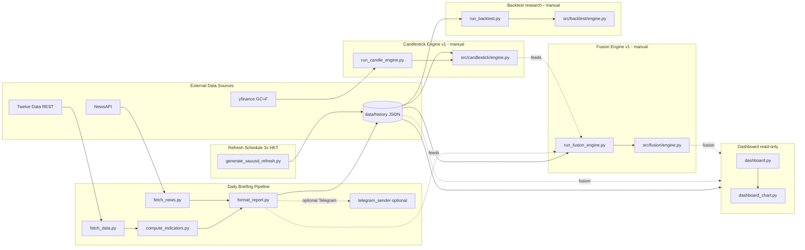
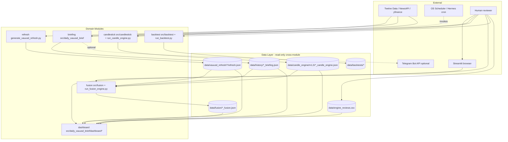

# XAUUSD System Architecture & Roadmap v1

> Status: v1 (snapshot 2026-07-08).
> Scope: documentation-only. No code changes.
> Audience: agent / human reviewer intending to evolve the system.

---

## 1. System Overview

The `daily-xauusd-bot` is a **manual-only XAUUSD research and briefing system**. It produces structured, rules-based research outputs that a human can read. It does NOT execute trades, does NOT auto-send Telegram signals beyond configured scheduler dispatches, and does NOT wire to any broker.

### 1.1 Component Inventory

| Num | Component | Path | Status |
|---|---|---|---|
| 1 | Daily Briefing (full pipeline) | `src/daily_xauusd_brief/` | live |
| 2 | Refresh Schedule (3x/day HKT) | `scripts/generate_xauusd_refresh.py` | live |
| 3 | Candlestick Direction Engine v1 | `src/candlestick/` + `scripts/run_candle_engine.py` | live (manual) |
| 4 | Fusion Engine v1 (confluence) | `src/fusion/` + `scripts/run_fusion_engine.py` | live (manual) |
| 5 | Dashboard + Fusion Decision Cockpit | `src/daily_xauusd_brief/dashboard.{py,chart.py}` | live |
| 6 | Backtest Research Module | `src/backtest/` + `scripts/run_backtest.py` | live (manual) |
| R1 | Engine Review Log | `scripts/log_engine_review.py` + `data/engine_reviews.csv` | live (manual) |
| R2 | Engine Ops / Health | `scripts/engine_ops_logger.py` + `query_engine_ops.py` | live (read-only dashboard) |

### 1.2 Legacy / Co-existing Components

> These components coexist with v1 modules but are NOT part of v1 roadmap.
> Documented for context only; must NOT be removed without explicit approval.

| Path | Note |
|---|---|
| `src/candlestick_engine/` (v3 M2) | Older unified engine; superseded by `src/candlestick/` v1. Kept for historical review entries. |
| `src/fusion_engine/` (V4) | Older fusion; different schema (`fusion_bias`, `consensus_label`). Displayed separately in Dashboard under V4 Fusion Engine Summary. |


---

## 2. High-Level System Flow

This diagram shows the live runtime flow — from data sources through modules to the dashboard surface. All arrows are READ-direction; writes go only into explicit output directories.



Notes:
- Solid arrows: data dependency. Dashed arrows: optional / derived feed.
- Telegram sender path is OPTIONAL and only invoked by configured scheduler dispatch; never on manual invocation.
- All modules write to their own subdir under `data/`; cross-module writes are forbidden except where the engine explicitly tracks provenance.


---

## 3. Module Boundary Diagram

Module boundaries relevant for future extension. Modules on the same level communicate only through JSON files written under the shared `data/` subdirs. No module imports another module at this level; they consume each other's outputs as opaque JSON.



Boundary rules (enforced by code review, not by type system):

1. Domain modules (M1-M6) NEVER import each other.
   They share state strictly via JSON / CSV under `data/`.
2. Only M1 and M2 write to external APIs (Twelve Data, NewsAPI) read paths.
   M3/M4/M6 derive from those reads but never call external APIs themselves.
3. Only M1 optionally writes to Telegram. All other modules are local-only.
4. M5 (dashboard) is READ-ONLY. It NEVER writes to `data/`.
5. D_BRI, D_REF, D_CAN, D_FUS are append-only artifacts with timestamps in their filename. The newest file (lexicographic) is the current state.


---

## 4. Current Modules (purpose / inputs / outputs / responsibility)

### 4.1 Daily Briefing - `src/daily_xauusd_brief/`

**Purpose.** End-of-pipeline aggregator that produces a daily human-readable research note for XAUUSD, dispatched (optionally) to Telegram.

**Inputs.** Twelve Data (price/indicators), NewsAPI, Twelve Data news, local cache.

**Outputs.** `data/history/<mode>_<date>T<time>.json` (machine-readable) + `reports/gold/<date>.md` (human-readable) + optional Telegram message.

**Responsibilities.**
- Fetch price + indicators (RSI, MACD, ATR, MA20, MA50, MA200).
- Fetch and rank news.
- Compose final summary suitable for mobile Telegram reading.
- Persist last-known-good outputs into `data/history/` for later review.

**Non-responsibilities.**
- Does not trigger or schedule itself; cron / scheduler does that.
- Does not modify `data/xauusd_refresh/` (separate scheduler).
- Does not call into Candlestick / Fusion engines.

### 4.2 Refresh Schedule - `scripts/generate_xauusd_refresh.py`

**Purpose.** Produce structured intraday refreshes at 3 fixed HKT times:
- 08:15 morning (overnight + open + event watch)
- 14:45 pre_london (asia summary + london risk + bias update)
- 20:15 pre_ny (london summary + us event risk + ny expectation)

**Inputs.** Twelve Data + NewsAPI snapshot at the time of the refresh.

**Outputs.** `data/xauusd_refresh/<mode>/<date>T<time>_refresh.json` + `_refresh.md`. Refresh Telegram dispatch handled separately by `run_daily.sh` invocation mode.

**Responsibilities.** Compose 3 fixed-shape refresh briefings; persist.
**Non-responsibilities.** Does NOT decide trade. Does NOT auto-signal.

### 4.3 Candlestick Direction Engine v1 - `src/candlestick/`

**Purpose.** Rules-based K-line direction classifier for XAUUSD anchor frames (M1, M5). Scalping-friendly. Manual-only invocation.

**Inputs.** Live OHLCV via yfinance `GC=F` (or saved CSV). Period `5y` default with 6mo fallback. 5min TTL cache.

**Outputs.** JSON/CSV/MD report in `data/candle_engine/m{1,5}/<date>T<time>_candle_engine.{json,csv,md}`.

**Responsibilities.**
- Detect 13 candle features, 8 patterns, structure sequences (HH/HL/LH/LL), breakouts, sweeps.
- Compute 6 states, 5 scores, 1 confidence score, context tags, warnings.

**Non-responsibilities.**
- Does NOT auto-signal; no Telegram emission.
- Does NOT modify browser data sources beyond TTL cache.

### 4.4 Fusion Engine v1 - `src/fusion/`

**Purpose.** Combine the most recent Briefing/Refresh payload with the most recent Candlestick Engine payload into a single confluence decision.

**Inputs.** Latest JSON from `data/xauusd_refresh/*/...refresh.json` (or `data/history/..._briefing.json`) AND latest JSON from `data/candle_engine/m{1,5}/..._candle_engine.json`. Either can be omitted (graceful degradation).

**Outputs.** `data/fusion/<date>T<time>_fusion.{json,csv,md}` with fields:
- `decision` in {long_watch, short_watch, wait, no_trade}
- `decision_strength`, `confluence_score`, `directional_bias`, `bias_strength`
- `market_regime`, `risk_state`, `entry_readiness`
- 4 layer scores: `context_score`, `price_action_score`, `environment_score`, `quality_score`
- `reasons[]`, `conflicts[]`, `warnings[]`
- `inputs_used[]`, `missing_inputs[]`

**Responsibilities.**
- Detect staleness (threshold 60min) and apply quality penalty.
- Apply hard-block rules: market closed, no trade stance, both stale, missing all inputs, extremes (event risk + bias conflict).
- Emit deterministic decision enum and provenance.

**Non-responsibilities.**
- Does NOT execute or trigger anything.
- Does NOT auto-trade or auto-signal.
- Does NOT mutate briefing/refresh/candle outputs.

### 4.5 Dashboard + Fusion Decision Cockpit - `src/daily_xauusd_brief/dashboard*.py`

**Purpose.** Read-only Streamlit surface for human review; integrated Fusion Decision Cockpit shows latest candle + fusion + briefing summary in one view.

**Inputs.** All assets in `data/` (read).

**Outputs.** Browser-only. No file writes, no Telegram.

**Responsibilities.**
- Render chart with overlays (Lightweight Charts via `dashboard_chart.py`).
- Render Fusion Decision Cockpit card with strength/confluence/bias/regime/risk/entry.
- 4-layer score breakdown, reasons/conflicts/warnings/inputs tabs.
- Chart markers for fusion decisions (long_below / short_above / wait_inbar / no_market_only).
- Show Ops Health (success rate, duration p50/p95, error types).

**Non-responsibilities.**
- Does NOT modify `data/`.
- Does NOT auto-refresh unless user explicitly enables.

### 4.6 Backtest Research Module - `src/backtest/`

**Purpose.** Replay historical signals through bar-history simulation with cost modeling. Used for strategy calibration. Manual-only.

**Inputs.** Saved OHLCV (CSV via yfinance) or recorded CSV.

**Outputs.** `data/backtests/<date>T<time>_<strategy>_<mode>.{csv,md,xml,html,...}`

**Responsibilities.**
- Run strategies through historical bars.
- Apply cost models (spread/slippage/commission).
- Emit performance metrics, breakdown by regime/session.

**Non-responsibilities.**
- Does NOT execute trades even in simulation-connectable mode.
- Does NOT modify live `data/history/` or `data/candle_engine/`.

### 4.7 Engine Review Log - `scripts/log_engine_review.py`

**Purpose.** Structural log of every manual engine invocation. Provides feedback for calibration (confidence buckets, outcome labels).

**Inputs.** Engine snapshot JSON.

**Outputs.** Append-only `data/engine_reviews.csv` (36 columns including `confidence_bucket`, `outcome_label`, `insufficient_context`).

**Responsibilities.** Auto-classify confidence bucket + format fields on write.
**Non-responsibilities.** Does NOT auto-fill outcome_label (human-only by design).

### 4.8 Engine Ops / Health - `scripts/engine_ops_logger.py` + `query_engine_ops.py`

**Purpose.** Observability for ad-hoc script runs. JSONL event store + queryable summary surface on the dashboard.

**Inputs.** Each ad-hoc script invocation (via logger wrapper).

**Outputs.** `data/engine_ops_events.jsonl` + dashboard-rendered `Ops Health` section.

**Responsibilities.** Record (script_name, status, duration_ms, finished_at, error). Read-only summary view.

**Non-responsibilities.** Does NOT mutate other modules' data.


---

## 5. Schema / Data Contracts (Summary)

| Artifact | Path | Schema | Owner |
|---|---|---|---|
| Briefing JSON | `data/history/<mode>_<date>T<time>.json` | 12 fields incl. `market_bias`, `volatility_regime`, `event_risk`, `trading_stance`, `confidence`, `key_levels`, `warnings` | Briefing |
| Refresh JSON | `data/xauusd_refresh/<mode>/<date>T<time>_refresh.json` | refresh-specific schema (timestamps, bias snapshot, event watch) | Refresh |
| Candle Engine JSON | `data/candle_engine/<tf>/<date>T<time>_candle_engine.json` | 25 fields incl. 6 states, 5 scores, `context_tags[]`, `warnings[]`, provenance | Candlestick |
| Fusion JSON | `data/fusion/<date>T<time>_fusion.json` | `decision` enum + 4 layer scores + reasons/conflicts/warnings/inputs | Fusion |
| Backtest CSV | `data/backtests/<date>_<strategy>_<mode>.csv` | trades table + summary metrics | Backtest |
| Engine Reviews | `data/engine_reviews.csv` | 36 columns, append-only | Review |
| Engine Ops | `data/engine_ops_events.jsonl` | one event per line, JSON | Ops |

Schema-version is mandatory:
- Each JSON producer emits a `schema_version` field.
- Consumers tolerate unknown fields (forward compat) but fail loud on missing required fields.
- Schema bumps require a versioned migration step (see Section 11).

### 5.1 Fusion Decision Schema (canonical)

```json
{
  "schema_version": "1.0",
  "decision": "no_trade|long_watch|short_watch|wait",
  "decision_strength": "weak|moderate|strong",
  "confluence_score": 0.0..100.0,
  "directional_bias": "bullish|bearish|neutral",
  "bias_strength": "weak|moderate|strong",
  "market_regime": "...",
  "risk_state": "...",
  "entry_readiness": "ready|caution|not_ready",
  "context_score": 0.0..100.0,
  "price_action_score": 0.0..100.0,
  "environment_score": 0.0..100.0,
  "quality_score": 0.0..100.0,
  "reasons": ["string", ...],
  "conflicts": ["string", ...],
  "warnings": ["string", ...],
  "inputs_used": ["briefing", "candle"],
  "missing_inputs": [],
  "generated_at": "ISO-8601 timestamp",
  "_candle_close": number|null,
  "_candle_direction_bias": number|null,
  "_candle_primary_state": string|null
}
```


---

## 6. Update Cadence / Runtime Model

### 6.1 Schedules (currently registered)

| Schedule | Cron (HKT) | Owner Module | Notes |
|---|---|---|---|
| morning_briefing | 08:15 (`run_daily.sh`) | Briefing | Linux cron or Task Scheduler wires `run_daily.sh` |
| pre_london_briefing | 14:45 (Hermes cron) | Refresh | via `generate_xauusd_refresh.py --mode pre_london` |
| pre_ny_briefing | 20:15 (Hermes cron) | Refresh | via `generate_xauusd_refresh.py --mode pre_ny` |
| daily_xauusd_refresh (morning) | 08:30 (Hermes cron) | Refresh/Briefing combined | full pipeline refresh |
| Daily Hong Kong Briefing | 00:30 (Hermes cron fc5b9c31a1fd/264e15bbd8dc) | Hermes-side | external |

### 6.2 TTLs and Cache Policy

- Candlestick engine yfinance cache: **5 minutes** in-memory.
- PollingMarketDataAdapter: Twelve Data daily quota cap, 1-min rate limit (8 req/min).
- Fusion staleness threshold (chart marker filter): **60 minutes**.
- Briefing refresh: **30-second** intrabar TTL inside `PollingMarketDataAdapter`.

### 6.3 Manual Invocation Patterns

```bash
# Candlestick manual:
python scripts/run_candle_engine.py --symbol GC=F --timeframe M1 --output both

# Fusion manual:
python scripts/run_fusion_engine.py --output text        # auto-discover latest
python scripts/run_fusion_engine.py --candle-only       # from candle only (degraded)

# Backtest manual:
python scripts/run_backtest.py --strategy baseline_ma --mode general --start 2025-01-01 --end 2025-12-31 --format both

# Engine review manual:
python scripts/log_engine_review.py --input /path/to/snapshot.json
```

---

## 7. Decision Model Summary (Fusion v1)

### 7.1 Decision Enum

- `no_trade`    -- hard block (market closed / extreme risk / no inputs / both stale / stance=no_trade)
- `wait`        -- mixed bias / conflicts / insufficient confluence / insufficient conviction
- `long_watch`  -- bullish alignment + avg >= 45 + no hard block
- `short_watch` -- bearish alignment + avg >= 45 + no hard block

### 7.2 Priority Order

1. `no_trade` (highest)
2. `wait`
3. `long_watch` / `short_watch` (mutually exclusive; depends on bias sign)

### 7.3 4-Layer Score Pipeline

1. `context_score`       -- briefing vs candle bias alignment + event risk penalty
2. `price_action_score`  -- candlestick conviction + structure + rejection + momentum + pattern bonus
3. `environment_score`   -- regime fit + volatility + sequence + compression
4. `quality_score`       -- missing-inputs penalty + staleness * 0.7 + conflict * 0.75 + extreme_event * 0.8 + closed * 0.5

These roll into `confluence_score` (weighted average) which gates `long_watch` / `short_watch`.


---

## 8. Manual-only / Read-only Guardrails

### 8.1 Forbidden Actions (system-wide)

- Calling any broker API (MT4/MT5/IBKR/Binance/etc.).
- Sending orders, modifying positions, or bridging to live accounts.
- Auto-firing Telegram messages without explicit human approval.
- Auto-refreshing dashboard without explicit user opt-in.
- Auto-recording `outcome_label` or auto-calibrating engine weights.
- Auto-promoting `decision=no_trade` to anything else.

### 8.2 Required Labels in Module Docstrings

Every script in `scripts/` and entry-point in `src/` declares in its module docstring, in plain English:

- `Manual-only` -- only runnable by explicit human invocation
- `live` -- scheduled / dispatched by registered cron
- `read-only` -- never writes to `data/` except its own namespace
- `non-execution` -- does NOT trade, place orders, or connect to liquidity venues

### 8.3 Boundary Files

The following files are **boundary contracts** and require TODO review before edits:

- `scripts/run_daily.sh` / `scripts/run_daily.bat` -- scheduler pipeline entry
- `src/daily_xauusd_brief/telegram_sender.py` -- the only Telegram entry point
- `src/daily_xauusd_brief/main.py` -- orchestration; should remain broker-free
- `src/fusion/engine.py` -- ONLY changing rules requires new machine-readable tests

### 8.4 Rule Change Protocol

Per `docs/rule_change_protocol.md`: any change to scoring weights, decision thresholds, or staleness windows requires:
1. Proposal entry in `docs/rule_changes.md`,
2. 1-week shadow validation against historical fusion data,
3. 4-week validation in dashboard, and
4. Monthly board report sign-off.


---

## 9. Current Completion Status

| Area | Status | Completion | Notes |
|---|---|---|---|
| Daily Briefing (full pipeline) | live | 100% | E1-E11 series; cron-ready |
| Refresh Schedule (3x HKT) | live | 100% | `97421d4` baseline |
| Candlestick Engine v1 | live | 100% | 4-layer engine, JSON/CSV/MD outputs |
| Fusion Engine v1 (decision enum) | live | 100% | 9 scenarios validated |
| Fusion Dashboard Cockpit | live | 90% | card + scores + tabs; chart overlays complete |
| Backtest Research | live | 70% | baseline + scalping strategies; performance metrics live |
| Engine Review Log | live | 90% | auto-classification; outcome_label is manual-only |
| Engine Ops / Health | live | 100% | queryable summary on dashboard |
| Cron / Refresh Dispatch | live | 100% | Hermes + Linux cron + Windows Task Scheduler all supported |
| Manual-only Guardrails | live | 100% | docstring + boundary-file conventions enforced by review |
| Live Trade Wiring | **NOT planned** | -- | explicit non-goal (see Section 10) |
| Auto-Signal Telegram | **NOT planned** | -- | explicit non-goal |
| Auto-Calibration Loop | **NOT planned** | -- | explicit non-goal |


---

## 10. Roadmap

Roadmap divided into 3 horizons. Each item is **future work** if not yet implemented; nothing in this section modifies code behavior.

### 10.1 Near-term (next 1-3 months)

- **N1**: Add calibration CSV -> confidence bucket heatmap (5 buckets) visualization.
- **N2**: Add `outcome_label` migration backfill script for historical review entries.
- **N3**: Promote Candlestick Engine to wiring point in Fusion as a *first-class* input (already supported; verify by line-coverage check).
- **N4**: Add ops dashboard alert threshold (~20% error rate currently a `st.warning`).
- **N5**: Implement a small cross-validation harness for Fusion Engine weights (uses *historical* fusion JSON only; never on live decision).
- **N6**: Add explicit `data/fusion/index.json` summarizing the latest decision per day (for fast dashboard load).

### 10.2 Mid-term (3-9 months)

- **M1**: Multi-day Fusion engine: ingest last N Days of briefings + candles to   detect structural cross-timeframe alignment.
- **M2**: Add a *Scenario Lab* surface on the dashboard for what-if overlays   (no broker; only what-if 'if I had taken this watch' tracker).
- **M3**: Backtest parity surface: backtest metrics vs review log correlation table.
- **M4**: Add per-session performance breakdown (Asia / London / NY) to dashboard.
- **M5**: Author `docs/spec/fusion_v1.md` as the canonical scoring-spec contract.
- **M6**: Add a `Weekly Fusion digest` markdown; manual-generation only.

### 10.3 Later (9+ months)

- **L1**: Multi-symbol extension hook (in AGENTS.md scope; CME gold futures + spot).
- **L2**: Cross-asset context (DXY, US10Y) as optional additional Fusion inputs.
- **L3**: Decision reliability scoring using a held-out historical window.
- **L4**: Add a *Fusion v2* scoring engine in parallel (shadow-run mode, log-only).
- **L5**: Explore pluggable exchange data adapters (still no auto-trade).

Each roadmap item requires:
1. A proposal entry in `docs/architecture/roadmap_<id>.md`,
2. A clear `manual-only` boundary clause,
3. A revert script in `scripts/revert_<id>.py`.


---

## 11. Non-Goals

These are explicitly NOT in scope for this system. Documenting prevents scoping creep and keeps the manual-only contract honest.

1. **Trade execution** (broker / order placement / position management).
2. **Auto-signal Telegram emission** beyond scheduled briefing dispatch.
3. **Auto-calibration** of engine weights from outcomes.
4. **Cross-account** / multi-user features (single-user, single-account).
5. **Web-based order entry** or anything resembling a trading UI.
6. **Sub-second latency pricing** or HFT-style work (out of scope; we use 1m/5m).
7. **Portfolio / risk across symbols** (XAUUSD single-symbol scope only).
8. **Auto-deployment** of rule changes (manual rule_change_protocol.md only).


---

## 12. Change Safety / Rollback Notes

This system evolves manually. Two layers of safety:

### 12.1 Schema-level safety

- Every JSON artifact carries `schema_version`.
- Consumers fail loud on missing required fields and tolerate unknown fields.
- A schema bump REQUIRES a parallel migration in `data/<dir>/_migrations/`.

### 12.2 Behavior-level safety

- Algorithm changes (Fusion scoring, Candlestick feature set, Backtest cost   model) require entries appended to `docs/rule_changes.md` referencing the   shadow-validation run ID.
- Git revert is the primary rollback mechanism; tag each release with   `<module>-v<X>.<Y>.<Z>` so the user can `git checkout <tag>` a known-good state.

### 12.3 Rollback quick recipes

```bash
# Roll back last commit across modules
git revert HEAD --no-edit

# Roll back specific module to a known tag
git checkout tags/fusion-v1.0.0 -- src/fusion/ scripts/run_fusion_engine.py

# Inspect recent rule changes
git log --oneline -- docs/rule_changes.md
```

### 12.4 Emergency stop

To immediately halt all scheduled dispatches:

```bash
# Linux
bash scripts/setup_cron_linux.sh --uninstall

# Windows
powershell .\scripts\setup_task_windows.ps1 -Uninstall

# Hermes
hermes cronjob pause <job_id>
```

Manual invocations remain unaffected -- the user must simply stop calling them.

---

End of v1. Future versions increment the suffix (v2, v3, etc.). Each new version re-baselines the Inventory Table (Section 1.1), the Status Table (Section 9), and the Roadmap (Section 10); other sections are diff-ed against the previous version.
